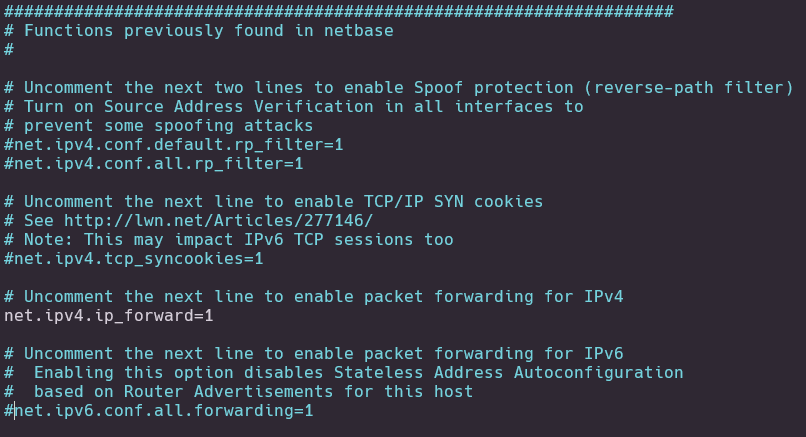
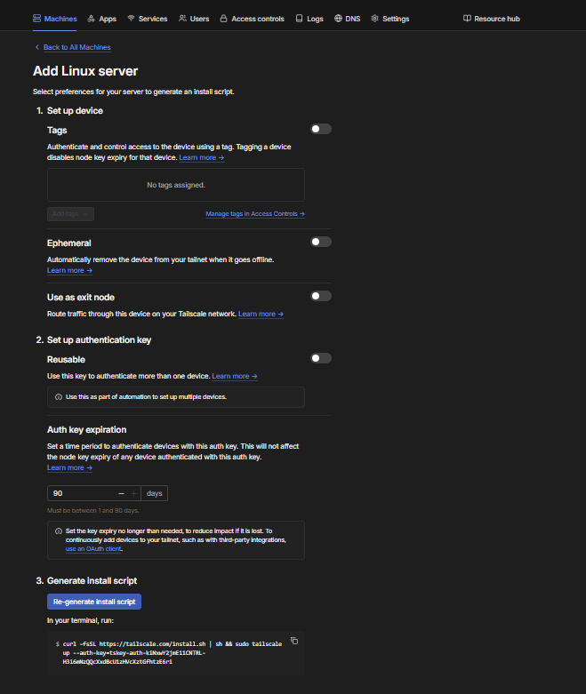
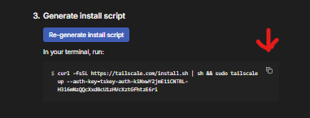
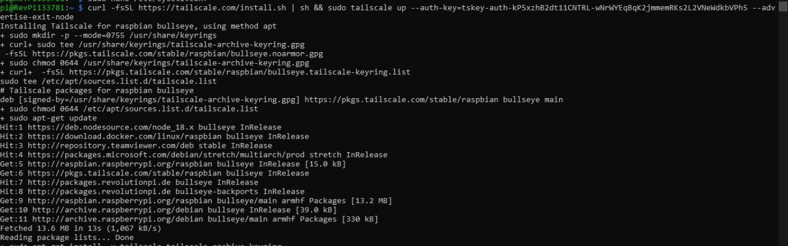
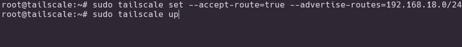

# 🚀 VPN Tunneling RevPi with Tailscale

A step-by-step guide to set up a VPN tunnel using Tailscale between a RevPi (Raspberry Pi-based PLC) and a Windows 10/11 client. This setup allows secure remote access into the RevPi network as if you're on the same LAN.

> ⚙️ Tested with:
> - Client OS: Windows 10 / 11
> - Remote Server: Revolution Pi (Debian-based) (example use RevPi Connect SE)
> - VPN: Tailscale
> - Subnet IP: 192.168.18.0/24
---

## 🧠 Prerequisites

- Tailscale account (create one at [https://tailscale.com](https://tailscale.com))
- Access to your RevPi via terminal or SSH
- Admin privileges on Windows and RevPi

---

## 🖥️ Step 1: Set Up Tailscale on Windows Client

1. Go to [https://tailscale.com/download](https://tailscale.com/download) and download Tailscale for Windows.
2. Install and run Tailscale.
3. Find the Tailscale icon in the taskbar tray (usually bottom-right).
4. **Right-click → Login** → A browser window will open asking you to authenticate with your Tailscale account.
5. After login, your Windows device will be added to your Tailscale network.

---

## 📡 Step 2: Enable IPv4 Forwarding on RevPi

To allow the RevPi to route traffic between networks:

```bash
sudo nano /etc/sysctl.conf
```


Uncomment or add the following line:

```conf
net.ipv4.ip_forward=1
```



Apply the change without rebooting:

```bash
sudo sysctl -p
```

---

## 🐧 Step 3: Add RevPi to Tailscale Network

1. In your Tailscale Admin Panel → click **Add device** → choose **Linux Server**.
2. Set the settings as shown in the image below.
    
3. Copy the auto-generated install command and authorization key.
    
4. Paste and run that install script on your RevPi:

```bash
curl -fsSL https://tailscale.com/install.sh | sh
sudo tailscale up --authkey <your_auth_key>
```


---

## ⚙️ Step 4: Setting & Start Tailscale on RevPi

Once you have installed Tailscale, you can configure the settings:

1. Set Routes
```bash
sudo tailscale set --accept-routes=true --advertise-routes=192.168.18.0/24
```

2. Up Tailscale
```bash
sudo tailscale up
```



---

## 🧪 Step 5: Testing the VPN Tunnel

1. On your **Windows client**, open Command Prompt or PowerShell.
2. Run:

```powershell
ping <RevPi-local-IP-address>
```

or (if you know the Tailscale IP):

```powershell
ping <RevPi-Tailscale-IP>
```

✅ You should get ping replies. This means the tunnel is working!

---

## 🛠️ Optional Tips

- To make RevPi Accept Route from tailscale, enable it via Tailscale Admin → Machines → Enable Accept Route.
- You can access the RevPi web UI or SSH using its **Tailscale IP address**, even from outside the LAN.
- Make sure firewall rules allow ICMP (ping) or desired ports.

---

## 🧾 References

- Official Tailscale Docs: https://tailscale.com/kb/1017/install
- RevPi Documentation: https://revolutionpi.com/documentation/

---

Enjoy your secure remote RevPi access! 💡
